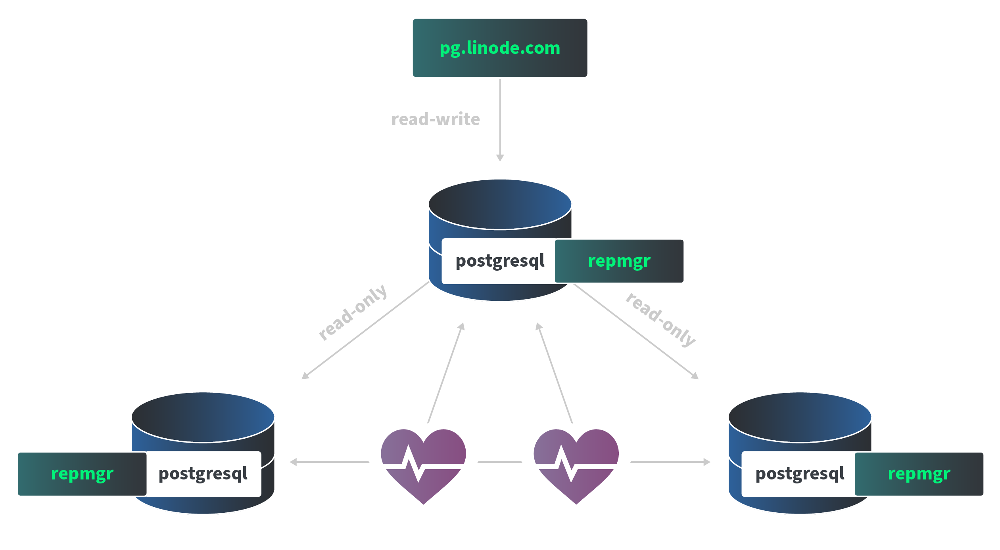

# Linode Marketplace Postgresql Cluster

Create a highly available Postgresql database cluster using the [Linode Ansible Collection](https://github.com/linode/ansible_linode) and [Repmgr](https://repmgr.org/) through the Linode Marketplace.

**Distributions:**
- Debian 11 

**Postgresql:**
 - 14

**Repmgr:**
- 5.3

## Documentation

Deployment guide:
- [Deploying a PostgreSQL Cluster throught the Linode Marketplace](https://www.linode.com/docs) (Coming soon...)

Additonal resources:

- https://repmgr.org/docs/repmgr.html
- https://repmgr.org/docs/5.3/repmgr-command-reference.html
- https://repmgr.org/docs/current/index.html

## Contributing
Contributions are welcome! Please generally adhere to the [sample directory layout](https://docs.ansible.com/ansible/latest/user_guide/sample_setup.html#sample-ansible-setup) and best practices/recommondations from the latest Ansible [User Guide](https://docs.ansible.com/ansible/latest/user_guide/index.html).

Please read the [developement guidelines](docs/DEVELOPMENT.md) for help with setting up a development environment and the [contributing guidelines](docs/CONTRIBUTING.md) for help creating your first Pull Request.

## Reaching Out
To report a bug or request a feature, please open a GitHub Issue. For general feedback, use feedback@linode.com.

## Author

- Elvis Segura (@n0vabyte)
